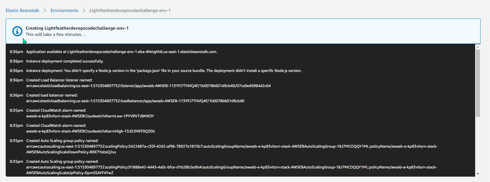

# Overview
This repository contains a React frontend, and an Express backend that the frontend connects to.

# Objective
Deploy the frontend and backend to somewhere publicly accessible over the internet. The AWS Free Tier should be more than sufficient to run this project, but you may use any platform and tooling you'd like for your solution.

Fork this repo as a base. You may change any code in this repository to suit the infrastructure you build in this code challenge.

# Submission
1. A github repo that has been forked from this repo with all your code.
2. Modify this README file with instructions for:
* Any tools needed to deploy your infrastructure
* All the steps needed to repeat your deployment process
* URLs to the your deployed frontend.

# Evaluation
You will be evaluated on the ease to replicate your infrastructure. This is a combination of quality of the instructions, as well as any scripts to automate the overall setup process.

# Setup your environment
Install nodejs. Binaries and installers can be found on nodejs.org.
https://nodejs.org/en/download/

For macOS or Linux, Nodejs can usually be found in your preferred package manager.
https://nodejs.org/en/download/package-manager/

Depending on the Linux distribution, the Node Package Manager `npm` may need to be installed separately.

# Running the project
The backend and the frontend will need to run on separate processes. The backend should be started first.
```
cd backend
npm ci
npm start
```
The backend should response to a GET request on `localhost:8080`.

With the backend started, the frontend can be started.
```
cd frontend
npm ci
npm start
```
The frontend can be accessed at `localhost:3000`. If the frontend successfully connects to the backend, a message saying "SUCCESS" followed by a guid should be displayed on the screen.  If the connection failed, an error message will be displayed on the screen.

# Configuration
The frontend has a configuration file at `frontend/src/config.js` that defines the URL to call the backend. This URL is used on `frontend/src/App.js#12`, where the front end will make the GET call during the initial load of the page.

The backend has a configuration file at `backend/config.js` that defines the host that the frontend will be calling from. This URL is used in the `Access-Control-Allow-Origin` CORS header, read in `backend/index.js#14`

# Optional Extras
The core requirement for this challenge is to get the provided application up and running for consumption over the public internet. That being said, there are some opportunities in this code challenge to demonstrate your skill sets that are above and beyond the core requirement.

A few examples of extras for this coding challenge:
1. Dockerizing the application
2. Scripts to set up the infrastructure
3. Providing a pipeline for the application deployment
4. Running the application in a serverless environment

This is not an exhaustive list of extra features that could be added to this code challenge. At the end of the day, this section is for you to demonstrate any skills you want to show that’s not captured in the core requirement.

# Lightfeather DevOps Code challenge Start : Execution Steps

Recommended Tools and Services Required to Deploy your infrastructure:
Intellij IDE, AWS Codepipeline, AWS Beanstalk

#   1) Clone your Github project into you local after forked from Team-LightFeather/devops-code-challenge. Then make required changes before check-in back the updated code.


#   2) AWS Beanstalk Serverless Application creation for nodejs. This service will create EC2 instance, S3 and IAM security required for application

#   Application Coniguration


#   Applicaiton creation steps





#   Applicaiton instance started


#   3) AWS Codepipeline creation: Connects to github and deploys changes to ec2 instance created through beanstalk. Any changes in github automatically triggers codepipeline to deploy the changes.

 


Successful start of the application:


